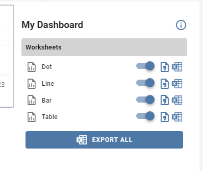

# Tableau Extension - Toggle & Export Sheets

#### An introduction to basic Extensions API capabilities!


- Toggle worksheet visibility
- Export sheet as CSV
- Export sheet as Excel
- Export all sheets as Excel

This is my first foray into the world of the Tableau Extensions API! This is meant to be an example/tutorial of some introductory API functionality, as well as how to integrate with a modern JavaScript framework -- Vue.js.

### Blog post/YouTube to follow!

---
# Vue.JS specific commands:
## Project setup
```
npm install
```

### Compiles and hot-reloads for development
```
npm run serve
```

### Compiles and minifies for production
```
npm run build
```

### Lints and fixes files
```
npm run lint
```

### Customize configuration
See [Configuration Reference](https://cli.vuejs.org/config/).
